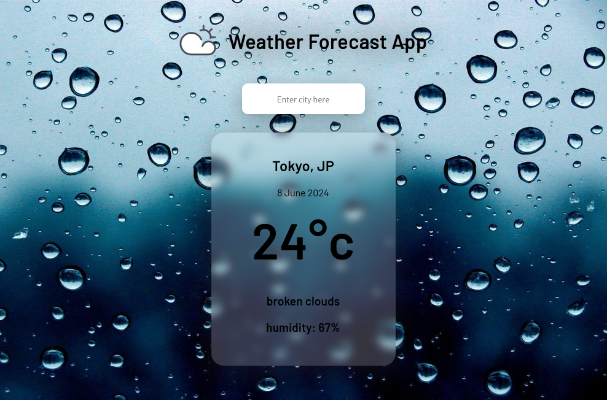

# Weather Forecast App

Welcome to the Weather Forecast App! ☀️🌧️⛈️

This web application allows users to check the weather forecast for their location and other locations around the world.

## Features

- Get the current weather conditions for your location.
- View detailed forecasts including temperature, humidity, wind speed, etc.
- Search for weather forecasts for specific locations.
- Responsive design for desktop and mobile devices.

## How to Use

1. **Accessing the App:**
   - Visit the live site [here](https://yourusername.github.io/weather-forecast-app).
   - Alternatively, clone this repository to your local machine and open `index.html` in your preferred web browser.

2. **Getting Weather Forecast:**
   - Upon loading the app, the current weather conditions for your location will be displayed.
   - To view the forecast for another location, use the search bar to enter the desired location.

3. **Interacting with the App:**
   - Click on different elements of the forecast to view additional details such as hourly forecast, extended forecast, etc.
   - Navigate between different views using intuitive buttons or gestures.

## Technologies Used

- HTML/CSS/JavaScript
- [Insert any libraries/frameworks used, e.g., Bootstrap, jQuery, etc.]
- [Insert any APIs used, e.g., OpenWeatherMap API]

## Demo

## Contributing

Contributions are welcome! If you have any ideas for improvements or new features, feel free to submit a pull request.

## License

This project is licensed under the [MIT License](LICENSE).
